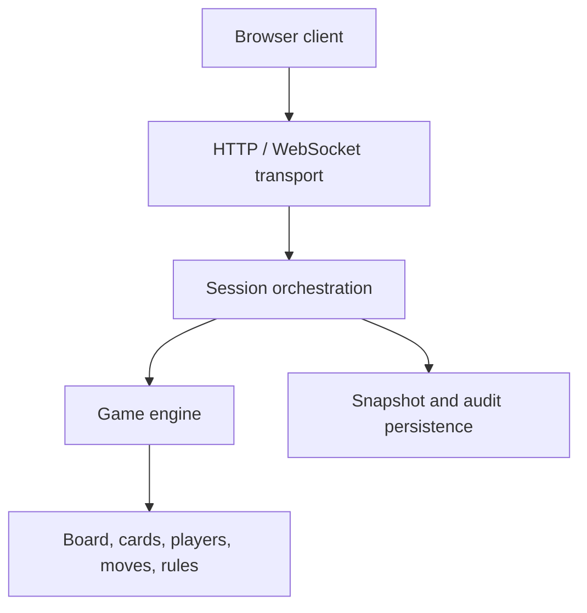

# Architecture

## Overview

Toc is a single-process asynchronous web application. FastAPI serves HTTP endpoints and the static browser client, while one WebSocket connection per participant carries lobby state, prompts, player answers, and game updates. The Python process owns live sessions in memory and checkpoints started games to compressed JSON archives.



The server is authoritative. The browser renders state and submits choices, but legal moves, turn progression, kicking, victory, and persistence are decided by Python.

## Entry points and process-wide objects

`main.py` is intentionally small and re-exports `toc.application.app` for the deployment command `uvicorn main:app`.

`toc/application.py`:

- configures structured application logging;
- creates the FastAPI application;
- registers HTTP and WebSocket routers;
- mounts `web/` at `/toc/play`;
- runs startup recovery and the session monitor through the application lifespan.

`toc/runtime.py` creates the three process-wide collaborators:

- `PlayerInputRouter`, which connects game prompts to participant messages;
- `CompressedJsonStore`, which reads and writes archives;
- `ConnectionManager`, which owns live sessions and recovery.

This module avoids circular construction across route modules. It also means the supported production topology is one Uvicorn worker: live sessions are local to one process and are not coordinated across multiple workers.

## Package responsibilities

### `toc/model`

The domain and rules engine, independent of HTTP routing.

| Module | Responsibility |
|---|---|
| `game.py` | Dealing, turn progression, card exchange, move execution, victory, and gameplay audit calls |
| `board.py` | Board construction, position lookup, legal move generation, blocking, houses, seven split, and hop geometry |
| `player.py` | One seat's identity, hand, pawn count, and interactive choice workflow |
| `cards.py` | Cards, draw pile, discard pile, Jokers, and deck recycling |
| `hand.py` | Cards held by a seat and aggregate move generation |
| `move.py` | A selected game action: actor, pawn owner, origin, target, card, and step count |
| `spot.py` | Ordinary and house position occupancy and blocking state |
| `rules.py` | Immutable rule values, validation, presets, and UI schema |
| `game_mode.py` | Participant, seat, team, layout, deck, and deal definitions |
| `game_phase.py` | Serializable progress states needed for exact resume |
| `audit.py` | Typed audit events and event-detail validation |
| `params.py` | Card symbols, colours, house size, and model constants |

### `toc/session`

The application layer around a game.

| Module | Responsibility |
|---|---|
| `game_session.py` | Lobby configuration, seat creation, lifecycle timestamps, game task, checkpointing, restore, broadcasts, and audit sequencing |
| `connection_manager.py` | Live-session registry, join-code allocation, open-lobby listing, timeout monitoring, suspension, and startup recovery |
| `input_router.py` | Per-participant input/output queues, pending prompts, request correlation, reconnection, and stale-input rejection |
| `roster.py` | Participants, seats, uniqueness constraints, and mode-specific seat ordering |
| `session_participant.py` | Runtime link between one participant record and the seat/player objects they control |

### `toc/transport`

| Module | Responsibility |
|---|---|
| `http_routes.py` | Status, rule metadata, open lobbies, and game creation |
| `websocket_routes.py` | Connection acceptance, identity handshake, resume-token checks, message validation, and input/output tasks |

Transport code should translate malformed external input into protocol errors. It should not implement card or board rules.

### `toc/persistence`

| Module | Responsibility |
|---|---|
| `archive_store.py` | Atomic, compressed JSON file storage |
| `snapshot_state.py` | Exact resumable session and game state |
| `finished_state.py` | Validated, non-resumable final archive |
| `persistent_state.py` | Shared immutable state records and serialization helpers |

### `toc/infrastructure`

| Module | Responsibility |
|---|---|
| `identity.py` | Player/join-code normalization, IDs, resume tokens, and token hashing |
| `messages.py` | Translatable server-message construction and key registry |
| `app_logging.py` | JSON log formatting and log-level configuration |
| `clock.py` | Real and test clocks |
| `versions.py` | Engine, rules, archive, and WebSocket protocol versions |

### `web`

The browser application uses native JavaScript modules and a shared `app` namespace.

| File | Responsibility |
|---|---|
| `index.html` | Semantic screen structure and module entry point |
| `toc.css` | Desktop/mobile layout, board, cards, animations, and components |
| `translations.js` | English and French translation dictionaries |
| `js/context.js` | Shared DOM references, state, constants, and application namespace |
| `js/app.js` | Startup and event-listener wiring |
| `js/i18n.js` | Language selection and translated DOM updates |
| `js/lobby.js` | Rule editor, modes, open-lobby list, and lobby rendering |
| `js/socket.js` | WebSocket lifecycle, incoming dispatch, and outgoing protocol messages |
| `js/board.js` | Board geometry, seats, pieces, and active-player display |
| `js/cards.js` | Hand rendering, card interaction, discard pile, and animation |
| `js/ui.js` | General screen, error, log, prompt, and responsive helpers |

## Core domain relationships

A participant and a player are not interchangeable:

- `Participant` is a persistent human identity with a name, participant ID, resume-token hash, connection state, and router ID.
- `PlayerSeat` binds a participant to a team, colour, and `Player` object.
- `Player` represents one playable seat and owns a hand and pawn counters.
- `SessionParticipant` groups the participant with all seats they control and their shared WebSocket.

In most modes there is one seat per participant. In `duel_four`, each participant owns two `PlayerSeat` and `Player` objects that share one participant, router ID, and browser connection.

## Lobby-to-game flow

1. `POST /toc/api/create-game` validates the selected rules and mode.
2. `ConnectionManager` creates a `GameSession` under a human-readable join code.
3. A browser opens a WebSocket and sends the identity handshake.
4. A new participant receives a persistent participant ID and resume token; an existing one must prove its token.
5. `configure-player` assigns the required colours and team, creating one or more seats.
6. The roster derives a seat order from the game-mode patterns.
7. When participant and seat capacities are met and everyone is configured, `GameSession` marks the session started and creates its game task.
8. `Game` constructs the board in ordered seat colours, deals, prompts, executes moves, and checks victory.

## Prompt and answer flow

Interactive server messages receive a unique `requestId` in `PlayerInputRouter`. The browser includes that ID in its answer. The router accepts input only when:

- a prompt is pending for that participant;
- the answer's `requestId` matches the pending prompt; and
- the per-participant input queue does not already contain the same response.

This prevents unsolicited, duplicate, or stale clicks from advancing the game. The pending prompt is retained across a disconnect and replayed after reconnection.

## Concurrency model

- FastAPI and the engine run on one asyncio event loop.
- Each connected WebSocket uses an input task and output task in an `asyncio.TaskGroup`.
- Each active game has one game-loop task.
- Setup and start operations use locks to prevent simultaneous participants from claiming the same team/colour or starting a game twice.
- Disk operations are serialized per session and moved to worker threads where needed so compression and file I/O do not block the event loop.
- The input queue has a maximum size of one because only one response to the current prompt is actionable.

## Translation contract

Public text messages are constructed with:

```python
buildMessage(messageType, messageKey, fallback, parameters=None, **payload)
```

The browser looks up `messageKey`, interpolates `parameters`, and uses `fallback` when it does not know the key. Payload fields cannot replace reserved translation fields. Tests check that literal backend keys are registered and that English and French dictionaries have matching coverage.

## Extension points

- Add a rule field to `GameRules`, validation, schema choices, translations, engine branches, serialization, and tests.
- Add a mode by defining participant/seat/team patterns, a deck-compatible deal schedule, and any Joker count in `game_mode.py`; update UI choices/translations and mode tests.
- Add a client message by updating the allowed types, structural validation, session dispatch, browser sender, and WebSocket tests.
- Add resumable progress by extending `game_phase.py` and snapshot validation before inserting new checkpoint locations.
- Add an audit event only with an explicit detail schema and finished-archive validation.

Any change to persisted or over-the-wire structure should be accompanied by a format/protocol version decision and round-trip tests.
