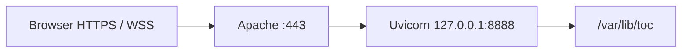

# Deployment and operations

This guide describes the intended small, private Raspberry Pi deployment: Apache terminates HTTPS, Uvicorn listens only on localhost, systemd supervises one application process, and archives live outside the source checkout.

## Production topology



Use one Uvicorn worker. Live games, queues, and connection ownership are in process memory; multiple independent workers would not share them.

Port 443 belongs to Apache because it handles public TLS. Port 8888 is a private loopback port used only between Apache and Uvicorn. The application does not need to bind 443 or manage certificates itself.

## Operating-system packages

On Raspberry Pi OS/Debian:

```bash
sudo apt update
sudo apt install python3 python3-venv apache2
sudo a2enmod proxy proxy_http proxy_wstunnel ssl headers
```

Use the existing certificate setup, commonly Certbot/Let's Encrypt, for the HTTPS virtual host.

## Install the application

The examples use `/var/www/html/toc` and service account `zigo`.

```bash
cd /var/www/html/toc
python3 -m venv .venv
source .venv/bin/activate
python -m pip install --upgrade pip
python -m pip install -r requirements.txt
```

If pip reports an `externally-managed-environment`, the command is using the system interpreter rather than a usable virtual environment. Install `python3-venv`, recreate/activate `.venv`, and verify:

```bash
which python
python -m pip --version
```

Both paths should point below `/var/www/html/toc/.venv`.

Confirm the WebSocket runtime explicitly:

```bash
/var/www/html/toc/.venv/bin/python -c "import websockets; print(websockets.__version__)"
```

`uvicorn` alone does not necessarily install a WebSocket implementation. This project's pinned `requirements.txt` includes `websockets==17.1`; do not remove it.

## Persistent data directory

Create a state directory owned by the service user:

```bash
sudo install -d -o zigo -g zigo -m 750 /var/lib/toc
```

This creates the directory if absent, sets owner/group to `zigo`, and permissions to `rwxr-x---`. `/var/lib` is the conventional location for variable application state that must survive restarts and source deployments. It is not limited to programming libraries.

Keeping game data outside `/var/www/html/toc` prevents `git pull`, release replacement, or checkout cleanup from deleting archives.

## systemd service

Create `/etc/systemd/system/toc.service`:

```ini
[Unit]
Description=Toc FastAPI game server
Wants=network-online.target
After=network-online.target

[Service]
Type=simple
User=zigo
Group=zigo
WorkingDirectory=/var/www/html/toc
Environment=PYTHONUNBUFFERED=1
Environment=TOC_DATA_DIRECTORY=/var/lib/toc
Environment=TOC_LOG_LEVEL=INFO
ExecStart=/var/www/html/toc/.venv/bin/python -m uvicorn main:app --host 127.0.0.1 --port 8888
Restart=on-failure
RestartSec=5
UMask=0077

[Install]
WantedBy=multi-user.target
```

Then load and start it:

```bash
sudo systemctl daemon-reload
sudo systemctl enable --now toc.service
sudo systemctl status toc.service
```

After dependency or code updates:

```bash
cd /var/www/html/toc
source .venv/bin/activate
python -m pip install -r requirements.txt
sudo systemctl restart toc.service
```

The service uses the virtual-environment Python by absolute path. Activating a virtual environment in your interactive shell has no effect on an already-running systemd service.

## Apache reverse proxy

The simplest configuration sends all Toc traffic through Uvicorn, with the more-specific WebSocket mapping first:

```apache
<IfModule mod_ssl.c>
<VirtualHost *:443>
    ServerName www.example.com

    SSLEngine on
    SSLCertificateFile /etc/letsencrypt/live/www.example.com/fullchain.pem
    SSLCertificateKeyFile /etc/letsencrypt/live/www.example.com/privkey.pem

    ProxyPreserveHost On

    ProxyPass        "/toc/ws/" "ws://127.0.0.1:8888/toc/ws/"
    ProxyPassReverse "/toc/ws/" "ws://127.0.0.1:8888/toc/ws/"

    ProxyPass        "/toc/" "http://127.0.0.1:8888/toc/"
    ProxyPassReverse "/toc/" "http://127.0.0.1:8888/toc/"

    ErrorLog ${APACHE_LOG_DIR}/toc-error.log
    CustomLog ${APACHE_LOG_DIR}/toc-access.log combined
</VirtualHost>
</IfModule>
```

Because `ProxyPass` rules are checked in order, keep `/toc/ws/` before `/toc/`.

Alternatively, Apache may serve `web/` directly while proxying only API and WebSocket paths:

```apache
Alias /toc/play/ /var/www/html/toc/web/
<Directory /var/www/html/toc/web>
    Options -Indexes +FollowSymLinks
    DirectoryIndex index.html
    AllowOverride None
    Require all granted
</Directory>

ProxyPass        "/toc/ws/" "ws://127.0.0.1:8888/toc/ws/"
ProxyPassReverse "/toc/ws/" "ws://127.0.0.1:8888/toc/ws/"
ProxyPass        "/toc/api/" "http://127.0.0.1:8888/toc/api/"
ProxyPassReverse "/toc/api/" "http://127.0.0.1:8888/toc/api/"
```

Do not combine a broad `Alias /toc ...` with proxy paths unless you understand Apache's matching precedence. The full-proxy option is easier to reason about for this low-traffic service.

Validate and reload Apache:

```bash
sudo apachectl configtest
sudo systemctl reload apache2
```

## Verification

First test Uvicorn directly on the Pi:

```bash
curl -i http://127.0.0.1:8888/toc
curl -i http://127.0.0.1:8888/toc/api/open-lobbies
sudo ss -ltnp | grep ':8888'
```

Then test through Apache:

```bash
curl -i https://www.example.com/toc
curl -i https://www.example.com/toc/api/open-lobbies
```

Finally open `https://www.example.com/toc/play/`, create a lobby, and verify the browser establishes a `wss://.../toc/ws/...` connection.

## Logs

The application emits one compact JSON object per log line to stdout. systemd captures it in the journal.

```bash
sudo journalctl -u toc.service -n 100 --no-pager
sudo journalctl -u toc.service -f
sudo journalctl -u toc.service --since today
```

Set `TOC_LOG_LEVEL=DEBUG` temporarily when diagnosing prompt or state behaviour, then return to `INFO` to avoid excess output on the Pi.

Useful structured fields include `sessionId`, `joinCode`, `playerId`, `routerId`, `playerName`, `messageType`, and `event`. Uvicorn's access and lifecycle messages may remain ordinary text alongside application JSON.

Apache logs are normally under `/var/log/apache2/`.

## WebSocket troubleshooting

### HTTP works, WebSocket returns 404

Characteristic Uvicorn messages:

```text
WARNING: Unsupported upgrade request.
WARNING: No supported WebSocket library detected.
GET /toc/ws/... HTTP/1.1 404 Not Found
```

Cause: the exact Python environment used by the running service cannot import `websockets` or `wsproto`.

Check with the service interpreter, not merely the activated shell:

```bash
/var/www/html/toc/.venv/bin/python -m pip show websockets
/var/www/html/toc/.venv/bin/python -c "import websockets; print(websockets.__file__)"
systemctl show toc.service -p ExecStart -p WorkingDirectory -p Environment
```

Install from the pinned file and restart:

```bash
/var/www/html/toc/.venv/bin/python -m pip install -r /var/www/html/toc/requirements.txt
sudo systemctl restart toc.service
```

A restart matters: Uvicorn detects the available WebSocket implementation when the server process starts.

### No request reaches Uvicorn

If `journalctl -f` shows no `/toc/ws/` request, inspect Apache configuration and modules:

```bash
sudo apachectl -M | grep -E 'proxy|wstunnel'
sudo apachectl -S
sudo tail -f /var/log/apache2/toc-error.log
```

### Browser uses `ws://` on an HTTPS page

The current client derives WSS from `window.location.protocol`. If it constructs `ws://` under HTTPS, ensure the deployed `web/js/socket.js` matches the current release and clear the browser cache.

### Service appears active but runs old code

```bash
systemctl show toc.service -p MainPID -p ExecStart -p WorkingDirectory
sudo readlink -f /proc/$(systemctl show -p MainPID --value toc.service)/cwd
git -C /var/www/html/toc status
git -C /var/www/html/toc log -1 --oneline
```

Restart after pulling and installing dependencies.

## Updating from Git

On the Pi, discard only changes you have explicitly decided are obsolete:

```bash
cd /var/www/html/toc
git status
git restore -- path/to/known-file
git clean -n -- path/to/known-untracked-item
```

Use `git clean -f` only after reviewing the `-n` preview and only for explicit targets. Never clean the data directory; keeping it in `/var/lib/toc` makes that easier.

Then update the selected branch:

```bash
git fetch origin
git switch feature/game-modes
git pull --ff-only
source .venv/bin/activate
python -m pip install -r requirements.txt
python -m pytest
sudo systemctl restart toc.service
```

Merge the release branch to `main` when it is the canonical release, then deploy `main` in the same way.

## Backups

Stop the service for a perfectly quiescent filesystem backup, or accept that an atomic archive transition may occur during a live copy.

```bash
sudo systemctl stop toc.service
sudo tar -C /var/lib -czf /safe/location/toc-game-data-$(date +%F).tar.gz toc
sudo systemctl start toc.service
```

Also back up the Git repository or rely on the remote Git host for source. The source repository does not contain runtime game data.

## Resource expectations

The design favours correctness and low operational complexity over throughput. A Raspberry Pi 1 can host a few private games, but compression, many simultaneous connections, and the full test suite are relatively CPU-intensive. Avoid reload mode in production, use one worker, and monitor:

```bash
systemctl status toc.service
free -h
df -h /var/lib/toc
```

## Security notes

- Keep Uvicorn bound to `127.0.0.1`; expose only Apache/TLS.
- Protect `/var/lib/toc`: active and suspended snapshots contain private hands and resume-token hashes; finished archives contain complete game history.
- Keep dependencies patched deliberately and rerun tests before deployment.
- Do not publish debug logs without reviewing player names and game metadata.
- For public hosting, add authentication, request/rate limits, origin policy, abuse controls, monitoring, and a documented privacy/retention policy.
